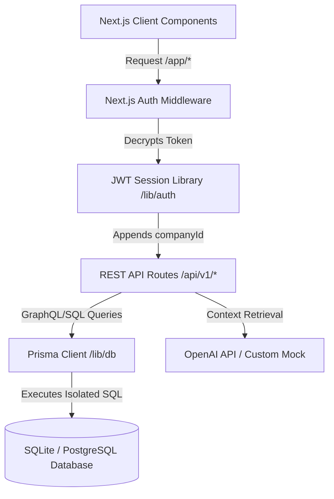
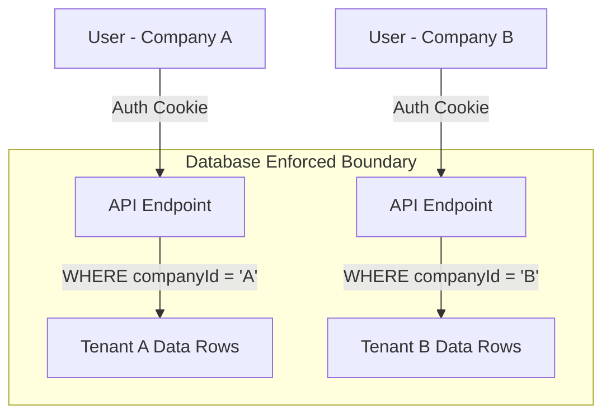
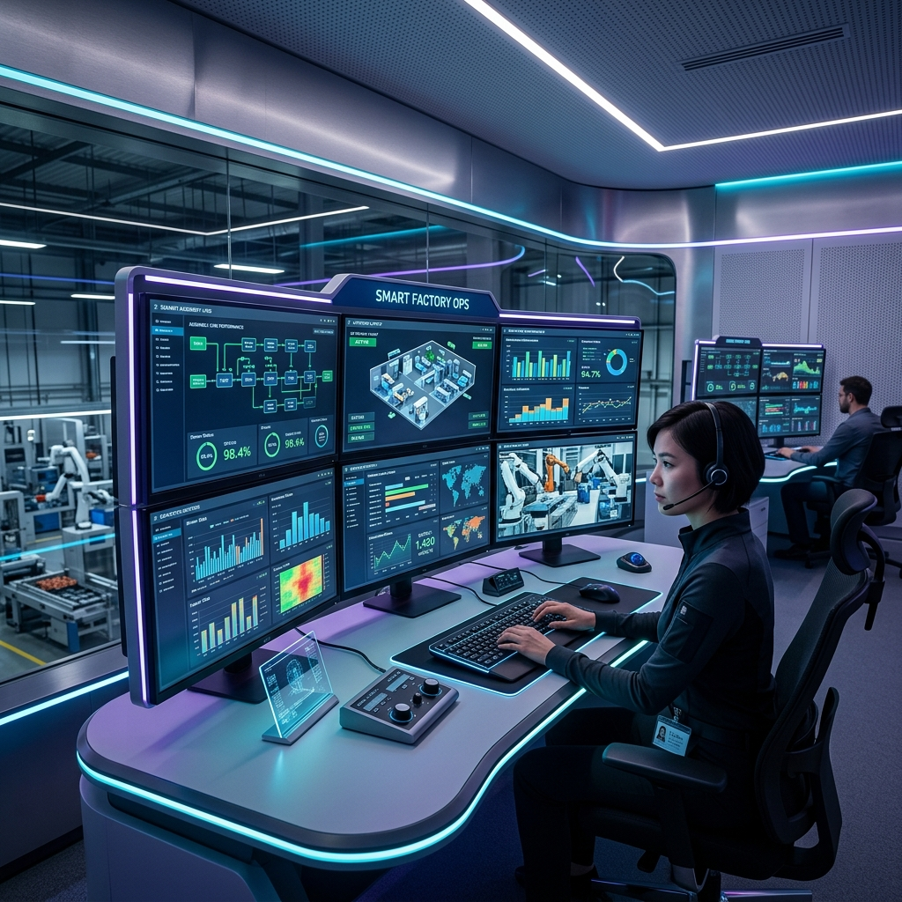

# FactoryOS AI — Enterprise Manufacturing ERP

<p align="center">
  
</p>

<p align="center">
  <a href="https://github.com/krisvasoya/FactoryOS/actions">
    
  </a>
  <a href="https://github.com/krisvasoya/FactoryOS/releases">
    
  </a>
  <a href="https://github.com/krisvasoya/FactoryOS/blob/master/LICENSE">
    
  </a>
  <a href="https://typescriptlang.org">
    
  </a>
  <a href="https://nextjs.org">
    
  </a>
  <a href="https://prisma.io">
    
  </a>
</p>

An enterprise-grade, AI-powered, multi-tenant Manufacturing ERP (Enterprise Resource Planning) and business management platform designed specifically for small-to-medium manufacturing companies. FactoryOS AI bridges the gap between raw shop floor operations and executive-level financial metrics, offering predictive insights, multi-tenant security, and an elegant warm user interface.

---

## 📋 Table of Contents

- [Overview](#-overview)
- [System Architecture](#-system-architecture)
- [Multi-Tenant Architecture](#-multi-tenant-architecture)
- [Key Features](#-key-features)
- [Screenshots](#-screenshots)
- [Tech Stack](#-tech-stack)
- [Folder Structure](#-folder-structure)
- [Database Schema](#-database-schema)
- [Authentication \& RBAC](#-authentication--rbac)
- [API Overview](#-api-overview)
- [AI Features \& Roadmap](#-ai-features--roadmap)
- [Security Model](#-security-model)
- [Performance Optimization](#-performance-optimization)
- [Installation Guide](#-installation-guide)
- [Environment Variables](#-environment-variables)
- [Available Scripts](#-available-scripts)
- [Development Roadmap](#-development-roadmap)
- [Contributing](#-contributing)
- [Testing](#-testing)
- [Deployment](#-deployment)
- [FAQ](#-faq)
- [License](#-license)
- [Credits](#-credits)

---

## 🌐 Overview

Manufacturing companies traditionally operate using disjointed systems: inventory is tracked in legacy spreadsheets, machine telemetry runs on disconnected panels, and invoices are handled in basic accounting packages. This silos critical data, causing material waste, machine downtime, and poor cash flow forecasting.

**FactoryOS AI** exists to unite these systems under a single, cohesive, modern workspace. It is a full-featured multi-tenant ERP platform providing:
* **Shop-floor Telemetry**: Live machine health and scheduling records.
* **Production Validation**: Real-time validation of materials against Bill of Materials (BOM) recipes during production run execution.
* **Financial Ledger Syncing**: Automated invoice generation, payment registration, and dynamic cost/revenue margin calculation.
* **Predictive AI Assistance**: An embedded AI Co-Pilot analyzing operations to forecast low-stock risks and suggest alternative material sourcing options.

It is built to serve managers, accountants, warehouse coordinators, and operators with clean layouts and responsive, warm interfaces.

---

## ⚙️ System Architecture

FactoryOS AI is built on a modern unified application architecture, using Next.js App Router, custom JWT sessions, and Prisma ORM to interact with a multi-tenant relational schema.



---

## 🔒 Multi-Tenant Architecture

FactoryOS AI uses a **shared-database, shared-schema** multi-tenancy model. Every tenant (Company) has complete logical data isolation enforced at the database layer.



### Tenancy Enforcement Rules:
1. **JWT Custom Payload**: The authenticated session token contains an encrypted payload including `companyId`.
2. **Implicit Query Filtering**: All API endpoints extract the `companyId` from the session token and explicitly inject it into the Prisma query parameters:
   ```typescript
   const inventoryItems = await db.inventoryItem.findMany({
     where: { 
       companyId: session.companyId, 
       deletedAt: null 
     }
   });
   ```
3. **No Direct Identifiers**: Users can never query records without an authenticated session, preventing horizontal privilege escalation.

---

## ✨ Key Features

| Module | Core Functionality | Included Attributes |
| :--- | :--- | :--- |
| **Dashboard** | Unified executive dashboard summarizing business health. | Metric cards, dynamic Recharts visuals, machine status telemetry, AI recommendations. |
| **Inventory** | Live inventory registers tracking raw materials and products. | Multi-warehouse stock tracking, low-stock threshold triggers, automated warnings. |
| **Production** | Bill of Materials recipe configuration and order workflow. | BOM builder, Production Order execution, raw material validation against storage. |
| **Finance** | Account ledgers tracking cost centers and cash flow. | Invoices, payment registers, automated cost-to-margin calculations, GST accounting. |
| **Employees**| Employee rosters, payroll, and timesheets. | Attendance tracking (clock-in/clock-out), department classifications, salary records. |
| **Machines**  | Shop-floor machinery tracking and telemetry. | Running hours telemetry, machine status pills (Active/Service/Offline), maintenance schedules. |
| **Reports**   | Visual and structured analytical exports. | CSV/PDF export, interactive charts, AI-generated operational summaries. |
| **AI Co-Pilot**| Floating intelligent chat assistant. | Contextual business insights, material forecasting, chat commands. |
| **Auth**      | Secure tenant and user portal access. | Role-Based Access Control, HTTPOnly JWT session cookies, password hashing. |

---

## 📸 Screenshots

### Dark Mode Dashboard (Executive View)


### Production Analytics & AI Insights


---

## 🛠 Tech Stack

| Layer | Technology | Usage in Repository |
| :--- | :--- | :--- |
| **Frontend Framework** | Next.js 16.2.9 (App Router) | Layout structure, page routing, and React server/client orchestration. |
| **Language** | TypeScript 5.x | Enforcing static type safety across schemas, API payloads, and layouts. |
| **Styling** | Tailwind CSS v4 | Clean UI layouts, modern theme tokens, and dynamic styling rules. |
| **Database** | SQLite (Dev) / PostgreSQL (Prod) | Structured relational storage supporting multi-tenant queries. |
| **ORM** | Prisma 6.19.3 | Query building, migrations, and database schema representation. |
| **Authentication** | Custom JWT (jose) + HTTPOnly Cookies | Stateless session state, cryptographically signed cookies, and RBAC. |
| **Cryptography** | bcryptjs | Hashing passwords with 10 salt rounds before database persistence. |
| **Data Fetching** | Client-side Fetch API | Next.js API endpoints interaction and clean UI reloading states. |
| **Visual Charts** | Recharts 3.8.1 | Custom Revenue vs Expenses bars and production output spline lines. |
| **AI Integration** | OpenAI API | Intelligently analyzing database metrics to generate suggestions. |

---

## 📂 Folder Structure

```
factory-os/
├── prisma/
│   ├── dev.db                 # SQLite development database
│   ├── schema.prisma          # Database schema (tenants, RBAC, financials, production)
│   └── seed.js                # Core demo seed data containing 4 distinct roles
├── src/
│   ├── app/
│   │   ├── api/v1/            # API Endpoints (auth, dashboard, inventory, production, etc.)
│   │   ├── app/               # Private dashboard layouts & pages
│   │   │   ├── dashboard/     # Metric cards, Recharts boards, recent logs
│   │   │   ├── inventory/     # Warehouse stock management
│   │   │   └── ...            # Other private feature paths
│   │   ├── login/             # Authentication page
│   │   ├── register/          # Multi-tenant registration portal
│   │   ├── globals.css        # Main stylesheet (warm charcoal variables, animations)
│   │   └── layout.tsx         # Main layout wrapping context and pages
│   ├── components/
│   │   ├── header.tsx         # Top bar controls (dates, settings, notifications)
│   │   ├── sidebar.tsx        # Navigation menu and active session profile card
│   │   ├── ai-assistant.tsx   # Floating AI Co-Pilot chat drawer
│   │   └── theme-context.tsx  # Context manager toggling light/dark mode
│   ├── lib/
│   │   ├── auth.ts            # JWT encrypt, sign, and session cookies
│   │   └── db.ts              # Prisma Client singleton
│   └── middleware.ts          # Route protection and tenant boundary verification
```

---

## 🗄 Database Schema

The complete relational schema consists of 23 models structure around strict logical separation:

* **Company**: The tenant account container. All transaction, user, and inventory data holds a foreign key constraint referencing a Company.
* **User**: Customer accounts linked to a Company. Roles define layout permissions (`Owner`, `Admin`, `Manager`, `Accountant`, `Production`, `Warehouse`, `Sales`, `Viewer`).
* **Category / Product / RawMaterial**: Standard items. Products are output goods; RawMaterials are inputs with purchase costs and warning thresholds.
* **Warehouse / InventoryItem / StockMovement**: Warehousing ledger tracking stock levels across dynamic actions (Transfer, Consumption, Adjustments).
* **BillOfMaterials / BOMItem**: The recipe system mapping a product to its necessary raw material weights/counts.
* **ProductionOrder**: Scheduling runs. Associates a product, machine, and quantity to a status queue (Pending, InProgress, Completed).
* **Machine / MaintenanceLog**: Asset registers tracking running hours telemetry and maintenance scheduling records.
* **Employee / Attendance**: Timesheet roster tracking clock registers, salary tiers, and payroll divisions.
* **Customer / Supplier / PurchaseOrder / SalesOrder**: B2B sales pipelines and material supply chains.
* **Invoice / Payment / Expense**: Double-entry ledger registers compiling company margins and GST details.
* **AuditLog**: Immutable trail record of all system queries (`Login`, `Create`, `Update`, `Delete`).
* **AIConversation**: Persisted record of chat transcripts with the AI Co-Pilot.

---

## 🔐 Authentication & RBAC

FactoryOS AI implements a custom, secure authentication system designed to satisfy corporate audits:

### Session Lifecycle
1. **Credentials verification**: Passwords are verified using `bcryptjs`.
2. **Stateless JWT**: Upon verification, a stateless JWT is signed using a cryptographic key with the `jose` library.
3. **HTTPOnly Cookie**: The signed token is sent as an HTTPOnly cookie with `SameSite=Lax` and `Secure` attributes enabled, protecting sessions from XSS.
4. **Middleware Validation**: The `src/middleware.ts` interceptor validates incoming `/app/*` requests. If no valid token is found, users are redirected to `/login`.

### Role-Based Access Control (RBAC)
User permissions are categorized into eight hierarchical roles:
* `Owner`: Full access, including billing, tenant administration, and database resets.
* `Admin`: Manage users, configurations, machines, and edit all data.
* `Manager`: Supervise shop floor actions, production planning, and inventory orders.
* `Accountant`: Access financial accounts, ledgers, invoices, and expenses.
* `Production`: Manage machines, clock production orders, and check BOMs.
* `Warehouse`: Inventory reception, warehouse stock transfers, and raw material checks.
* `Sales`: Create sales pipelines, manage customers, and queue orders.
* `Viewer`: Read-only access across the dashboard layouts.

---

## 🔌 API Overview

All API endpoints are prefixed with `/api/v1` and enforce session verification:

| Endpoint | Method | Authentication | Payload / Details |
| :--- | :--- | :--- | :--- |
| `/api/v1/auth` | `POST` | Public | Authentication: verifies credentials and sets HTTPOnly cookie. |
| `/api/v1/auth` | `GET` | Protected | Reads current session details and user profiles. |
| `/api/v1/auth` | `DELETE` | Protected | Clears authentication cookies and audits logout events. |
| `/api/v1/dashboard` | `GET` | Protected | Computes metric totals, machine status lists, and AI suggestions. |
| `/api/v1/inventory` | `GET` / `POST` | Protected | Fetches active warehouse quantities or logs stock movements. |
| `/api/v1/products` | `GET` / `POST` | Protected | Creates products or reads pricing and recipe structures. |
| `/api/v1/production` | `POST` | Protected | Commences production runs, validating stock bounds. |
| `/api/v1/finance` | `GET` | Protected | Computes GST reports, invoicing registers, and cash flow ledgers. |
| `/api/v1/ai` | `POST` | Protected | Communicates with the AI Co-Pilot, updating persisted logs. |

---

## 🤖 AI Features & Roadmap

The intelligent manufacturing advisor leverages OpenAI's models to parse the company context and provide recommendations:

```
+-------------------------------------------------------------+
| AI Co-Pilot Engine                                         |
+-------------------------------------------------------------+
               |
               +---> [Real-time Context Assembly] (Extracts inventory counts, margins)
               |
               +---> [Intelligent Recommendation Builder]
               |       * "Low stock detected for LED Modules (450 left). Reorder recommended."
               |       * "Machine 02 undergoing maintenance. BOM processed routed to Line 01."
               |
               +---> [OpenAI API Query / Context Fallback Mock]
```

### Future AI Roadmap:
- [ ] **Automated BOM Optimization**: Machine learning modeling to scan production runs and suggest alternate material ratios to reduce waste.
- [ ] **Predictive Machinery Maintenance**: Processing telemetry hours using regression models to predict mechanical errors before they happen.
- [ ] **Predictive Procurement**: Tracking supplier lead times to schedule automated purchase order queues.

---

## 🛡️ Security Model

### Implemented Security Measures
* **Stateless Protection**: HTTPOnly cookies containing signed JWT payloads block client-side access, mitigating cross-site scripting (XSS) risks.
* **Row-Level Multitenancy Isolation**: Database query limits are set using active session company identification tags (`companyId`).
* **Cryptographic Salting**: Passwords are saved as bcrypt hashes using 10 rounds of security salting.
* **Audit Logging**: Write transactions (`Create`, `Update`, `Delete`) generate audit trails recording the timestamp, IP address, and details.

### Planned Enterprise Security
* **MFA (Multi-Factor Authentication)**: Integrated TOTP secrets for user verification during portal sign-in.
* **API Rate Limiting**: Token-bucket validation inside Next.js API paths using a Redis server to block DDoS attempts.
* **Content Security Policy (CSP)**: Security headers blocking injection of external scripts and style sheets.

---

## ⚡ Performance Optimization

* **Dynamic Imports & Code Splitting**: Graph panels and charts (Recharts) are imported dynamically using Next.js `dynamic()` lazy loading, decreasing bundle size and load time.
* **Prisma Connection Pooling**: Singleton Client instances (`src/lib/db.ts`) prevent database connection limits from breaking during load spikes.
* **Optimized Joins**: Selective database fields are queried to reduce serialization delays.

---

## 🚀 Installation Guide

### Prerequisites
* **Node.js**: Version 18.x or later.
* **npm**: Version 9.x or later.

### Steps to Run Locally

1. **Clone the Repository**
   ```bash
   git clone https://github.com/krisvasoya/FactoryOS.git
   cd FactoryOS
   ```

2. **Install Project Dependencies**
   ```bash
   npm install
   ```

3. **Configure Environment Variables**
   Create a `.env` file in the root directory:
   ```bash
   cp .env.example .env
   ```

4. **Initialize Database and Migrations**
   ```bash
   npx prisma migrate dev --name init
   ```

5. **Seed Database with Demo Data**
   ```bash
   node prisma/seed.js
   ```

6. **Start Local Development Server**
   ```bash
   npm run dev
   ```

Open [http://localhost:3000](http://localhost:3000) to view the application.

---

## 🔑 Environment Variables

Make sure to configure the variables below in your `.env` configuration file:

```ini
# Database Connection String (Prisma format)
# SQLite for local development: "file:./dev.db"
DATABASE_URL="file:./dev.db"

# Secret token used for encrypting JWT auth cookies (32 character minimum)
JWT_SECRET="your-32-character-secret-key-goes-here"

# OpenAI Access Key (Optional. Disables live chat queries if empty)
OPENAI_API_KEY="sk-your-openai-api-key"

# Next.js Application URL
NEXT_PUBLIC_APP_URL="http://localhost:3000"
```

---

## 📜 Available Scripts

| Command | Action | Details |
| :--- | :--- | :--- |
| `npm run dev` | Starts local Next.js development server | Launches hot-reloading at http://localhost:3000. |
| `npm run build` | Compiles optimized production bundle | Prepares SSR components and compiles static assets. |
| `npm run start` | Launches compiled production server | Serves build bundle. Run after running `npm run build`. |
| `npm run lint` | Runs ESLint checker across the codebase | Validates typescript code styles and import usages. |
| `npx prisma studio` | Opens Prisma database explorer UI | Opens relational database schema inspector on http://localhost:5555. |

---

## 📈 Development Roadmap

### Completed Features
* [x] **Redesigned User Interface**: Modern and beautiful light mode default matching clean dashboard styling.
* [x] **Premium Dark Mode Theme**: Sleek, professional warm charcoal palette (`#0b0c0e`) with desaturated semantic colors.
* [x] **5-Card Metric Layout**: Displaying live Revenue, Net Profit, Orders, and Low Stock levels side-by-side.
* [x] **Sidebar Structure Refactor**: Relocated user profiles to the bottom-left sidebar and clean header bar.

### In Progress
* [ ] **Dynamic GST Reporting**: Interactive state taxes module detailing transaction tax structures.
* [ ] **Bulk CSV Imports**: Upload raw material sheets directly to warehouse inventory tables.

### Future Goals
* [ ] **Mobile Telemetry App**: Dedicated application for shop floor operators to log machine maintenance.
* [ ] **Predictive Machine Learning**: Forecasting product demand cycles based on seasonal client orders.

---

## 🤝 Contributing

We welcome contributions from developers, UI designers, and systems architects!

### Branch Conventions
* Feature additions: `feature/your-feature-name`
* Bug resolutions: `bugfix/your-fix-name`
* Chore/Docs edits: `chore/edit-details`

### PR checklist
1. Fork the repo and create your branch from `master`.
2. Verify typescript types compile: `npm run build`.
3. Check code styles: `npm run lint`.
4. Ensure database changes have a matching migration inside `prisma/migrations/`.

---

## 🛡️ Testing

The repository currently utilizes manual browser checks and compilation smoke tests.
We plan to introduce the following automated tests:
* **Unit testing**: Cypress / Jest tests validating password hashing and session cookie expiration structures.
* **End-to-End (E2E) testing**: Playwright tests logging in with the seed user accounts and performing simulated production runs.

To verify compiling build logic locally:
```bash
npm run build
```

---

## 🚢 Deployment

### 1. Vercel Deployment
To deploy this project to Vercel:
1. Connect your Github Repository to Vercel.
2. In Project Settings, configure the Environment Variables (`DATABASE_URL`, `JWT_SECRET`, `OPENAI_API_KEY`).
3. Add a build override or database setup script in Vercel to sync database connections before compiling.

### 2. Docker Setup (Planned)
We are currently assembling a Dockerfile and docker-compose configurations to orchestrate Next.js, PostgreSQL database nodes, and Redis session stores.

---

## ❓ FAQ

#### How do I log in to the demo server?
Once you run the database seed file (`node prisma/seed.js`), log in with the following details:
- **Username**: `owner@factoryos.com`
- **Password**: `password123`

#### Can I run this without an OpenAI API Key?
Yes! If `OPENAI_API_KEY` is not defined in `.env`, the system automatically falls back to a built-in knowledge library to provide mock insights, preserving complete dashboard UI features.

#### How does database tenancy work?
Every database row (e.g. products, machine maintenance) contains a `companyId` constraint. When a user requests data, the system extracts their company token and injects query boundaries, blocking access to other tenants.

---

## 📄 License

This project is licensed under the MIT License - see the [LICENSE](LICENSE) file for details.

---

## 👥 Credits

* **Krish Vasoya** — Creator and Project Lead.
* FactoryOS AI is an independent, community-driven open-source enterprise SaaS project.

---

<p align="center">
  Made with ❤️ using Next.js, TypeScript, Prisma, and AI.
</p>
